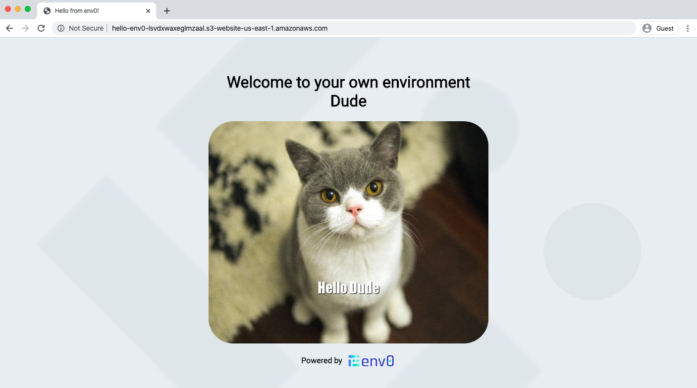

# Hello World on AWS
A static website S3 bucket serving an HTML greeting the user with his own custom cat imag

## Configuration

### Environment Variables
- `USER` - sets the user name to greet on the html generated from `index.template.html`
